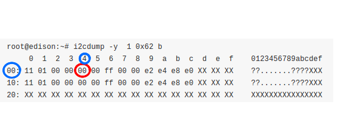

# Hands-On

Here we are going to experiment  how to communicate with a RGB LCD Display (http://www.seeedstudio.com/wiki/Grove_-_LCD_RGB_Backlight) and a barometric sensor (http://www.seeedstudio.com/wiki/Grove_-_Barometer_Sensor) from Grove, which by the way use I2C  as  communication protocol.

We will start with baby steps to later throw away UPM & MRAA:

* <font color="blue">Using libraries (UPM & MRAA)</font>
  * Shows how kids and not so hardcore nerds communicate with sensors
* <font color="blue">Look Ma! without Handles! (writing our own sensor code in user space)</font>
  * Teach you how to use user space i2C  libraries to communicate directly with your device.
* <font color="blue">I'm a Pro! (turning our sensor code into a module)</font>
  * We have gone way beyond from the comfort zone, lets get into the Kernel

<br>
<br>
###Using libraries (UPM & MRAA)
Do not misunderstand me , UPM and MRAA are great libraries, they really make things easier, specially when you are starting and you would like to get a prototype up and running fast, instead of struggling in how to get the values from your sensors and devices.

So first let's recap. MRAA is used to communicate to the device through I2C, PWM,SPI, etc.. on top of that UPM is used so at the end you just have to instantiate an object of the class of your device or sensor. lets see how we can do that:

####1. Check if the sensors are supported by MRAA
At the beginning we stated that we are going use the LCD RGB  Backlight Display and the Barometric sensor, please go to http://iotdk.intel.com/docs/master/upm/modules.html and find out either using the search on the top right corner or manually browse the sensor list to see if our sensors are supported by MRAA. 

So far you should have found the following info about our sensor and display:

* Barometric Sensor: MPL3115A2
  * http://iotdk.intel.com/docs/master/upm/classupm_1_1_m_p_l3115_a2.html
* LCD Display: Jhd1313m2
  * http://iotdk.intel.com/docs/master/upm/classupm_1_1_jhd1313m1.html

####2. Writing some code with UPM/MRAA
Lets write a program that reads the temperature from the Barometric sensor and display it in our RGB LCD.

Go to your Edison's command-line and use **nano** or **vim** to create a file called <font color="blue">lcd_temp.cpp</font> and add the following code:

```
#include <unistd.h>
#include <iostream>
#include <signal.h>
#include <string>
#include <sstream>
#include "jhd1313m1.h"
#include "mpl3115a2.h"

volatile int doWork = 0;
void sig_handler(int signo)
{
    if (signo == SIGINT) {
        printf("\nCtrl-C received.\n");
        doWork = 1;
    }
}
int main(int argc, char **argv)
{
	signal(SIGINT, sig_handler);
	float pressure    = 0.0;
	float temperature = 0.0;
	float altitude    = 0.0;
	float sealevel    = 0.0;	
	 
 	upm::Jhd1313m1 *lcd = new upm::Jhd1313m1(0, 0x3E, 0x62);
 	upm::MPL3115A2 *barometer = new upm::MPL3115A2(0, MPL3115A2_I2C_ADDRESS);
	lcd->setCursor(0,0);
	lcd->setColor(127, 255, 127);
	lcd->write("Temperature:");
	std::stringstream ss;
    while (!doWork) 
    {

        temperature = barometer->getTemperature(true);
        pressure    = barometer->getPressure(false);
        altitude    = barometer->getAltitude();
        sealevel    = barometer->getSealevelPressure();
        ss.str(std::string());
        ss<<temperature;
        lcd->setCursor(1,2);
    	lcd->write(ss.str());
        usleep (500000);
    }

    delete lcd;
    delete barometer;
    return 0;     
}
```
now lets create a <font color="blue">Makefile</font> with **vim/nano** to compile easily compile the program every time we do a change.

Quick question!, can you identify the upm libs needed to compile our program?

```
Answer: lupm-i2clcd and lupm-mpl3115a2
   the name of the lib needed can be infered visually from the upm  page of the sensor (URLS at the beginning of this capter), take a look in the upper left corner ;)
```

Our Makefile should look like this:

```

all: lcd_temp

lcd_temp:
	g++ -lmraa -lupm-i2clcd -lupm-mpl3115a2 -I/usr/include/upm/ lcd_temp.cpp -o lcd_temp
clean:
	rm lcd_temp *.*~ .*~
```

now you can type **make**, to trigger the compilation of our program, after that type **./lcd_temp** to run the program, to stop it just press **CTRL+c** 

If you do some changes you can recompile using **make**, sometimes when you do some changes and recompile, it will tell you that there are no changes, on those occassions you can do **make clean** and then **make**  that will erase the tempfiles created by vim when editing as well as the executable binary.
want to learn more about the [Makefile](https://www3.ntu.edu.sg/home/ehchua/programming/cpp/gcc_make.html) system? click [here](https://www3.ntu.edu.sg/home/ehchua/programming/cpp/gcc_make.html)

Using UPM/MRAA wasn't hard ins't it?, and it speed-up things if your sensor is already supported, but if not, you can write your own code and share it with he community, later  we will explore  how to add our not supported sensor to UPM.

####Look Ma! without Handles! 
In the earlier section we saw how to communicate with the sensors using high level libraries, but imagine we are in the scenario where we are creating our own hardware, during the earlier stages of fine tuning our hardware it is very useful and easier to communicate using the linux low level tools and libraries :), libraries that even MRAA and almost all linux drivers relies on. 

You will need to get acquainted with a set of tools called I2C Tools, for our purpouses the most common tools we are going to use are:

1. ***i2cdetect***
2. ***i2cdump***
3. ***i2cget***
4. ***i2cset***


**i2cdetect** : will help us list the i2c buses we have in our system and also show the addresses of the slaves connected to certain bus. Now go to your Edison and type <font color='blue'>i2cdetect -l</font> , you should get an output similar to this:

```
root@edison:~# i2cdetect -l
i2c-1	i2c       	i2c-designware-1                	I2C adapter
i2c-2	i2c       	i2c-designware-2                	I2C adapter
i2c-3	i2c       	i2c-designware-3                	I2C adapter
i2c-4	i2c       	i2c-designware-4                	I2C adapter
i2c-5	i2c       	i2c-designware-5                	I2C adapter
i2c-6	i2c       	i2c-designware-6                	I2C adapter
i2c-7	i2c       	i2c-designware-7                	I2C adapter

```
On the first Column we can see the **i2c-1** the leading number  indicates the number of the bus, in this case the bus is 1; Remember **Edison uses bus 0 and 6 if you are using the Edison Arduino Breakout Board**,  but if you are using Edison  Breakout board or the **Sparkfun Base Block the Bus 0 will be 1** and here comes the tricky part, because when using Edison in the Arduino Breakout Board a module will be loaded,preventing us to see the slaves addresses in the bus, for example run this command: <font color='blue'>i2cdetect -y -r 1</font>  we will get:

**For Edison using Arduino Breakout Board**
```
root@edison:~# i2cdetect -y -r 1
     0  1  2  3  4  5  6  7  8  9  a  b  c  d  e  f
00:          -- -- -- -- -- -- -- -- -- -- -- -- -- 
10: -- -- -- -- -- -- -- -- -- -- -- -- -- -- -- -- 
20: UU UU UU UU -- -- -- -- -- -- -- -- -- -- -- -- 
30: -- -- -- -- -- -- -- -- -- -- -- -- -- -- -- -- 
40: -- -- -- -- -- -- -- -- -- -- -- -- -- -- -- -- 
50: -- -- -- -- -- -- -- -- -- -- -- -- -- -- -- -- 
60: -- -- -- -- -- -- -- -- -- -- -- -- -- -- -- -- 
70: -- -- -- -- -- -- -- --  
```
**For Edison using the Sparkfun Base Block**
```
root@edison:~# i2cdetect -y -r 1
     0  1  2  3  4  5  6  7  8  9  a  b  c  d  e  f
00:          -- -- -- -- -- -- -- -- -- -- -- -- -- 
10: -- -- -- -- -- -- -- -- -- -- -- -- -- -- -- -- 
20: -- -- -- -- -- -- -- -- -- -- -- -- -- -- -- -- 
30: -- -- -- -- -- -- -- -- -- -- -- -- -- -- -- -- 
40: -- -- -- -- -- -- -- -- 48 -- -- -- -- -- -- -- 
50: -- -- -- -- -- -- -- -- -- -- -- -- -- -- -- -- 
60: -- -- 62 -- -- -- -- -- -- -- -- -- -- -- -- -- 
70: 70 -- -- -- -- -- -- -- 
```
For this reason from now on we will use Edison with the [Sparkfun Base Block](https://www.sparkfun.com/products/13045) or the MiniBreakout Board, since they interface directly with the  Edison's I2C pins, but this doesn't mean it is not possible to use the arduino breakout board as we will see next, so keep reading!.


**i2cdump**: will show us the content of a specific register in our device, the syntax is:<font color='blue'>i2cdump -y BUS ADDRESS b</font> so go to your edison and try to dumo the registers from the RGB device of the Display. the command should be <font color='blue'>i2cdump -y 1 0x62 b</font>  and the result should look something like this:

```
root@edison:~# i2cdump -y  1 0x62 b
     0  1  2  3  4  5  6  7  8  9  a  b  c  d  e  f    0123456789abcdef
00: 11 01 00 00 00 00 ff 00 00 e2 e4 e8 e0 XX XX XX    ??.......????XXX
10: 11 01 00 00 00 00 ff 00 00 e2 e4 e8 e0 XX XX XX    ??.......????XXX
20: XX XX XX XX XX XX XX XX XX XX XX XX XX XX XX XX    XXXXXXXXXXXXXXXX
30: XX XX XX XX XX XX XX XX XX XX XX XX XX XX XX XX    XXXXXXXXXXXXXXXX
40: XX XX XX XX XX XX XX XX XX XX XX XX XX XX XX XX    XXXXXXXXXXXXXXXX
50: XX XX XX XX XX XX XX XX XX XX XX XX XX XX XX XX    XXXXXXXXXXXXXXXX
60: XX XX XX XX XX XX XX XX XX XX XX XX XX XX XX XX    XXXXXXXXXXXXXXXX
70: XX XX XX XX XX XX XX XX XX XX XX XX XX XX XX XX    XXXXXXXXXXXXXXXX
80: 91 01 00 00 00 00 ff 00 00 e2 e4 e8 e0 XX XX XX    ??.......????XXX
90: 91 01 00 00 00 00 ff 00 00 e2 e4 e8 e0 XX XX XX    ??.......????XXX
a0: b1 01 00 00 00 00 ff 00 00 e2 e4 e8 e0 XX XX XX    ??.......????XXX
b0: b1 01 00 00 00 00 ff 00 00 e2 e4 e8 e0 XX XX XX    ??.......????XXX
c0: d1 01 00 00 00 00 ff 00 00 e2 e4 e8 e0 XX XX XX    ??.......????XXX
d0: d1 01 00 00 00 00 ff 00 00 e2 e4 e8 e0 XX XX XX    ??.......????XXX
e0: f1 01 00 00 00 00 ff 00 00 e2 e4 e8 e0 XX XX XX    ??.......????XXX
f0: f1 01 00 00 00 00 ff 00 00 e2 e4 e8 e0 XX XX XX    ??.......????XXX
```

Please from the above dump, can you determinate what is the value of register 0x04, 0x03, 0x02?, do you know to what those registers correspond to?, check the datasheet for the RGB controller.

**Answer:** the value for those 3 register is 0x00, to read the the dump we use the numbers from the left and the top like if they were coordinates, the sum of hose value is equal to the register you want to read. i.e, taking the blue cirles we have  0x00 + 0x04 = 0x04,  so the register 0x04 has the value 0x00 (as you can see in the red circle).



now for the question about what these registers represent, if you read datasheet you will find that they are PWM registers 0 to 3, PWMx — Individual brightness control registers these registers, and here it involves another protocol PWM which stands for Pulse width modulation (go check the protocols section). As color is a mix of Red, Green and Blue we can mix light by adjusting its brightnes and this registers do just that the control bright in a scale of 0 to 255 :) 

To see the other available registers take a look to page 11 of the [PC9633](documentation/PCA9633.pdf)


**12cset & i2cget**: these guys are used to set or retrieve the value of a specific register in our i2c device, so lets go and initiate the RGB controller of our Display and set the color to white :), you already know to what registers we should write (you found them in your datasheet) to set the color.

<font color='blue'></font>

Well in your Edison's command-line type each command and hit enter :)
```
i2cset -y 1 0x62 0x00 0x00
i2cset -y 1 0x62 0x08 0xFF
i2cset -y 1 0x62 0x01 0x20
i2cset -y 1 0x62 0x04 0xFF
i2cset -y 1 0x62 0x03 0xFF
i2cset -y 1 0x62 0x02 0xFF
```
What about that!, you just tapped into your i2c device, init the RGB controller and set the color to white, without any program!...

now take a look to lets say the register in charge of setting the red color(0x04) using **i2cget**. type this:<font color='blue'> i2cget -y 1 0x62 0x04</font>.

You should see this:
```
root@edison:~# i2cget -y 1 0x62 0x04
0xff
```
So, 0xFF (or 255 in decimal) is just the value we set using i2cset :) you can also check that by dumping the RGB controller and you should see something like this:

```
root@edison:~# i2cdump -y  1 0x62 b
     0  1  2  3  4  5  6  7  8  9  a  b  c  d  e  f    0123456789abcdef
00: 00 20 ff ff ff 00 ff 00 ff e2 e4 e8 e0 XX XX XX    . .......????XXX
10: 00 20 ff ff ff 00 ff 00 ff e2 e4 e8 e0 XX XX XX    . .......????XXX
20: XX XX XX XX XX XX XX XX XX XX XX XX XX XX XX XX    XXXXXXXXXXXXXXXX
30: XX XX XX XX XX XX XX XX XX XX XX XX XX XX XX XX    XXXXXXXXXXXXXXXX
40: XX XX XX XX XX XX XX XX XX XX XX XX XX XX XX XX    XXXXXXXXXXXXXXXX
50: XX XX XX XX XX XX XX XX XX XX XX XX XX XX XX XX    XXXXXXXXXXXXXXXX
60: XX XX XX XX XX XX XX XX XX XX XX XX XX XX XX XX    XXXXXXXXXXXXXXXX
70: XX XX XX XX XX XX XX XX XX XX XX XX XX XX XX XX    XXXXXXXXXXXXXXXX
80: 80 20 ff ff ff 00 ff 00 ff e2 e4 e8 e0 XX XX XX    ? .......????XXX
90: 80 20 ff ff ff 00 ff 00 ff e2 e4 e8 e0 XX XX XX    ? .......????XXX
a0: a0 20 ff ff ff 00 ff 00 ff e2 e4 e8 e0 XX XX XX    ? .......????XXX
b0: a0 20 ff ff ff 00 ff 00 ff e2 e4 e8 e0 XX XX XX    ? .......????XXX
c0: c0 20 ff ff ff 00 ff 00 ff e2 e4 e8 e0 XX XX XX    ? .......????XXX
d0: c0 20 ff ff ff 00 ff 00 ff e2 e4 e8 e0 XX XX XX    ? .......????XXX
e0: e0 20 ff ff ff 00 ff 00 ff e2 e4 e8 e0 XX XX XX    ? .......????XXX
f0: e0 20 ff ff ff 00 ff 00 ff e2 e4 e8 e0 XX XX XX    ? .......????XXX

```
See?, 0x04, 0x03, 0x02 no have 0xFF as their values, try setting the color toonly **Green **

**Answer**: you don't need to re initiate th RGB controller, just set the RGB registers to the correct values, to set the color to Green, we need R=0, G=255, B=0. so we only need to do:

```
i2cset -y 1 0x62 0x04 0x00
i2cset -y 1 0x62 0x03 0xFF
i2cset -y 1 0x62 0x02 0x00
```

Edison Arduino :
5v->vdd
gnd->gnd
A4->SDA
A5->SCL
 


####I'm a Pro!
