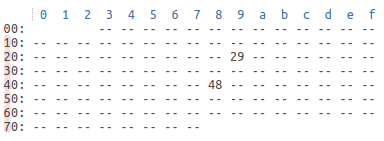

root@edison:~/# i2cdetect -y -r 1

with the command above i can see what's the address of two i2c devices i have attached to my edison, those correspond to a Sparkfun ADC block and a Sparkfun light sensor. I already know my ADC  has address 48 so the light sensor should be 29.

