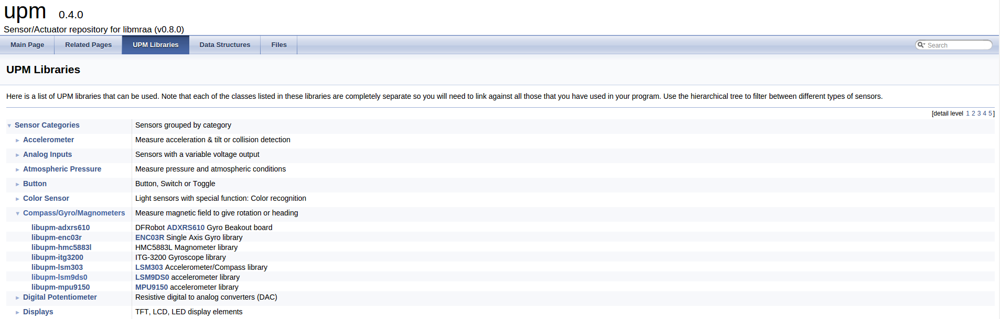

# Libraries: using mraa / UPM


##UPM (Useful Packages & Modules) Sensor/Actuator repository for MRAA

UPM is a high level repository for sensors that use MRAA. Each sensor links to MRAA and are not meant to be interlinked although some groups of sensors may be. Each sensor contains a header which allows to interface with it. Typically a sensor is represented as a class and instantiated.

The constructor is expected to initialise the sensor and parameters may be used to provide identification/pin location on the board.

Typically an update() function will be called in order to get new data from the sensor in order to reduce load when doing multiple reads to sensor data.


####Example

A sensor/actuator is expected to work as such (here is the MMA7660 accelerometer API):
```
 // Instantiate an MMA7660 on I2C bus 0
  upm::MMA7660 *accel = new upm::MMA7660(MMA7660_I2C_BUS,
                                         MMA7660_DEFAULT_I2C_ADDR);

  // place device in standby mode so we can write registers
  accel->setModeStandby();

  // enable 64 samples per second
  accel->setSampleRate(upm::MMA7660::AUTOSLEEP_64);

  // place device into active mode
  accel->setModeActive();

  while (shouldRun)
    {
      int x, y, z;

      accel->getRawValues(&x, &y, &z);
      cout << "Raw values: x = " << x 
           << " y = " << y
           << " z = " << z
           << endl;

      float ax, ay, az;

      accel->getAcceleration(&ax, &ay, &az);
      cout << "Acceleration: x = " << ax 
           << "g y = " << ay
           << "g z = " << az
           << "g" << endl;

      usleep(500000);
    }
```


####Where are the UPM includes in Edison?

If installed them though **OPKG**, then they should be here: <font color="green">/usr/include/upm</font>. If you want to see the full list of headers supported by your installed upm, type this:  <font color="green">ls -l /usr/include/upm</font>, which lists all the headers, i.e the following header are the ones supported in **Version: 0.3.2**:


```
-rw-r--r--    1 root     root          3192 Aug 13 00:23 a110x.h
-rw-r--r--    1 root     root          2933 May 19 16:28 aci_queue.h
-rw-r--r--    1 root     root          2157 May 19 16:28 aci_setup.h
-rw-r--r--    1 root     root          2723 May 19 16:28 acilib.h
-rw-r--r--    1 root     root          3154 Aug 13 00:23 ad8232.h
-rw-r--r--    1 root     root          6787 Aug 13 00:23 adafruitms1438.h
-rw-r--r--    1 root     root          3490 Aug 13 00:23 adafruitss.h
-rw-r--r--    1 root     root          9885 Aug 13 00:23 adc121c021.h
-rw-r--r--    1 root     root          6140 Aug 13 00:23 adis16448.h
-rw-r--r--    1 root     root          4024 Aug 13 00:23 adxl335.h
-rw-r--r--    1 root     root          3148 Aug 13 00:23 adxl345.h
-rw-r--r--    1 root     root          6824 Aug 13 00:23 ak8975.h
-rw-r--r--    1 root     root          5773 Aug 13 00:23 am2315.h
-rw-r--r--    1 root     root          2213 Aug 13 00:23 apds9002.h
-rw-r--r--    1 root     root          7703 Aug 13 00:23 at42qt1070.h
-rw-r--r--    1 root     root          2202 Aug 13 00:23 biss0001.h
-rw-r--r--    1 root     root          5604 Aug 13 00:23 bmpx8x.h
-rw-r--r--    1 root     root          3781 Aug 13 00:23 buzzer.h
-rw-r--r--    1 root     root          3342 Aug 13 00:23 cjq4435.h
-rw-r--r--    1 root     root          5360 Aug 13 00:23 ds1307.h
-rw-r--r--    1 root     root          5224 Aug 13 00:23 eboled.h
-rw-r--r--    1 root     root          4041 Aug 13 00:23 ecs1030.h
-rw-r--r--    1 root     root          3276 Aug 13 00:23 enc03r.h
-rw-r--r--    1 root     root          2107 Aug 13 00:23 es08a.h
-rw-r--r--    1 root     root          2336 Aug 13 00:23 flex.h
-rw-r--r--    1 root     root          3420 Aug 13 00:23 gas.h
-rw-r--r--    1 root     root          6921 Aug 13 00:23 gfx.h
-rw-r--r--    1 root     root          2533 Aug 13 00:23 gp2y0a.h
-rw-r--r--    1 root     root         10870 Aug 13 00:23 grove.h
-rw-r--r--    1 root     root          3439 Aug 13 00:23 grovecircularled.h
-rw-r--r--    1 root     root          2240 Aug 13 00:23 grovecollision.h
-rw-r--r--    1 root     root          3061 Aug 13 00:23 groveehr.h
-rw-r--r--    1 root     root          2199 Aug 13 00:23 groveeldriver.h
-rw-r--r--    1 root     root          2215 Aug 13 00:23 groveelectromagnet.h
-rw-r--r--    1 root     root          2242 Aug 13 00:23 groveemg.h
-rw-r--r--    1 root     root          2367 Aug 13 00:23 grovegsr.h
-rw-r--r--    1 root     root          2471 Aug 13 00:23 grovelinefinder.h
-rw-r--r--    1 root     root          2253 Aug 13 00:23 groveloudness.h
-rw-r--r--    1 root     root          5590 Aug 13 00:23 grovemd.h
-rw-r--r--    1 root     root          2430 Aug 13 00:23 grovemoisture.h
-rw-r--r--    1 root     root          2115 Aug 13 00:23 groveo2.h
-rw-r--r--    1 root     root          5305 Aug 13 00:23 grovescam.h
-rw-r--r--    1 root     root          3175 Aug 13 00:23 grovespeaker.h
-rw-r--r--    1 root     root          2835 Aug 13 00:23 grovevdiv.h
-rw-r--r--    1 root     root          2135 Aug 13 00:23 grovewater.h
-rw-r--r--    1 root     root          3870 Aug 13 00:23 grovewfs.h
-rw-r--r--    1 root     root          2275 Aug 13 00:23 guvas12d.h
-rw-r--r--    1 root     root         16875 Aug 13 00:23 h3lis331dl.h
-rw-r--r--    1 root     root          7067 May 19 16:28 hal_aci_tl.h
-rw-r--r--    1 root     root          3200 Aug 13 00:23 hcsr04.h
-rw-r--r--    1 root     root          4185 Aug 13 00:23 hm11.h
-rw-r--r--    1 root     root          3081 Aug 13 00:23 hmc5883l.h
-rw-r--r--    1 root     root          7601 Aug 13 00:23 hmtrp.h
-rw-r--r--    1 root     root         10892 Aug 13 00:23 hp20x.h
-rw-r--r--    1 root     root          2765 Aug 13 00:23 ht9170.h
-rw-r--r--    1 root     root          5847 Aug 13 00:23 htu21d.h
-rw-r--r--    1 root     root          5015 Aug 13 00:23 hx711.h
-rw-r--r--    1 root     root          2311 Aug 13 00:23 ina132.h
-rw-r--r--    1 root     root          2581 Aug 13 00:23 isd1820.h
-rw-r--r--    1 root     root          3567 Aug 13 00:23 itg3200.h
-rw-r--r--    1 root     root          3132 Aug 13 00:23 jhd1313m1.h
-rw-r--r--    1 root     root          2904 Aug 13 00:23 joystick12.h
-rw-r--r--    1 root     root          5299 Aug 13 00:23 l298.h
-rw-r--r--    1 root     root          1751 Aug 13 00:23 lcd.h
-rw-r--r--    1 root     root          6700 Aug 13 00:23 lcm1602.h
-rw-r--r--    1 root     root          2479 Aug 13 00:23 ldt0028.h
-rw-r--r--    1 root     root         25248 May 19 16:28 lib_aci.h
-rw-r--r--    1 root     root          2774 Aug 13 00:23 lol.h
-rw-r--r--    1 root     root          3341 Aug 13 00:23 lpd8806.h
-rw-r--r--    1 root     root          4918 Aug 13 00:23 lsm303.h
-rw-r--r--    1 root     root         43005 Aug 13 00:23 lsm9ds0.h
-rw-r--r--    1 root     root          8727 Aug 13 00:23 m24lr64e.h
-rw-r--r--    1 root     root          3388 Aug 13 00:23 max31723.h
-rw-r--r--    1 root     root          2576 Aug 13 00:23 max31855.h
-rw-r--r--    1 root     root          4617 Aug 13 00:23 max44000.h
-rw-r--r--    1 root     root          3176 Aug 13 00:23 max5487.h
-rw-r--r--    1 root     root          3826 Aug 13 00:23 maxds3231m.h
-rw-r--r--    1 root     root          3126 Aug 13 00:23 maxsonarez.h
-rw-r--r--    1 root     root          4420 Aug 13 00:23 mhz16.h
-rw-r--r--    1 root     root          3258 Aug 13 00:23 mic.h
-rw-r--r--    1 root     root          3702 Aug 13 00:23 mlx90614.h
-rw-r--r--    1 root     root          7671 Aug 13 00:23 mma7455.h
-rw-r--r--    1 root     root          9212 Aug 13 00:23 mma7660.h
-rw-r--r--    1 root     root          7939 Aug 13 00:23 mpl3115a2.h
-rw-r--r--    1 root     root          3401 Aug 13 00:23 mpr121.h
-rw-r--r--    1 root     root         29074 Aug 13 00:23 mpu60x0.h
-rw-r--r--    1 root     root          3577 Aug 13 00:23 mpu9150.h
-rw-r--r--    1 root     root          2351 Aug 13 00:23 mq2.h
-rw-r--r--    1 root     root          2319 Aug 13 00:23 mq3.h
-rw-r--r--    1 root     root          2743 Aug 13 00:23 mq303a.h
-rw-r--r--    1 root     root          2298 Aug 13 00:23 mq5.h
-rw-r--r--    1 root     root          2278 Aug 13 00:23 mq9.h
-rw-r--r--    1 root     root          2935 Aug 13 00:23 my9221.h
-rw-r--r--    1 root     root         11104 Aug 13 00:23 nrf24l01.h
-rw-r--r--    1 root     root          2365 Aug 13 00:23 nrf8001.h
-rw-r--r--    1 root     root          4101 Aug 13 00:23 nunchuck.h
-rw-r--r--    1 root     root          4932 Aug 13 00:23 otp538u.h
-rw-r--r--    1 root     root         11302 Aug 13 00:23 pca9685.h
-rw-r--r--    1 root     root         17279 Aug 13 00:23 pn532.h
-rw-r--r--    1 root     root          2630 Aug 13 00:23 ppd42ns.h
-rw-r--r--    1 root     root          3581 Aug 13 00:23 pulsensor.h
-rw-r--r--    1 root     root          2444 Aug 13 00:23 rfr359f.h
-rw-r--r--    1 root     root          4293 Aug 13 00:23 rgbringcoder.h
-rw-r--r--    1 root     root          3132 Aug 13 00:23 rotaryencoder.h
-rw-r--r--    1 root     root          3169 Aug 13 00:23 rpr220.h
-rw-r--r--    1 root     root          2963 Aug 13 00:23 sainsmartks.h
-rw-r--r--    1 root     root          4921 Aug 13 00:23 servo.h
-rw-r--r--    1 root     root         10325 Aug 13 00:23 si114x.h
-rw-r--r--    1 root     root          5624 Aug 13 00:23 sm130.h
-rw-r--r--    1 root     root          9711 Jun  2 00:28 ssd.h
-rw-r--r--    1 root     root          3622 Aug 13 00:23 ssd1308.h
-rw-r--r--    1 root     root          3860 Aug 13 00:23 ssd1327.h
-rw-r--r--    1 root     root         22748 Aug 13 00:23 st7735.h
-rw-r--r--    1 root     root          3385 Aug 13 00:23 stepmotor.h
-rw-r--r--    1 root     root          2447 Aug 13 00:23 sx6119.h
-rw-r--r--    1 root     root          2983 Aug 13 00:23 ta12200.h
-rw-r--r--    1 root     root          5345 Aug 13 00:23 tcs3414cs.h
-rw-r--r--    1 root     root          3235 Aug 13 00:23 th02.h
-rw-r--r--    1 root     root          4657 Aug 13 00:23 tm1637.h
-rw-r--r--    1 root     root          3045 Aug 13 00:23 tp401.h
-rw-r--r--    1 root     root          6078 Aug 13 00:23 tsl2561.h
-rw-r--r--    1 root     root          2825 Aug 13 00:23 ttp223.h
-rw-r--r--    1 root     root          3633 Aug 13 00:23 ublox6.h
-rw-r--r--    1 root     root          4153 Aug 13 00:23 uln200xa.h
-rw-r--r--    1 root     root          2163 Aug 13 00:23 waterlevel.h
-rw-r--r--    1 root     root          9438 Aug 13 00:23 wt5001.h
-rw-r--r--    1 root     root          2343 Aug 13 00:23 yg1006.h
-rw-r--r--    1 root     root         11332 Aug 13 00:23 zfm20.h
```


###HowTo: Using Edison - 9 Degrees of Freedom Block from sparkfun

As stated before the use of UPM is to make easier the use sensors or blocks from third party companies like sparkfun, so if you don't require it or you find that the UPM implementation is limited somehow, you can use mraa alone and from there start to write your own code, this example, will show you how to compile the lsm9ds0 example from the UPM examples available here: https://github.com/intel-iot-devkit/upm/blob/master/examples/c%2B%2B/lsm9ds0.cxx

first lets take a quick look to the 9DOF block:

The 9 Degrees of Freedom Block for the Intel® Edison uses the LSM9DS0 9DOF IMU for full-range motion sensing. This chip combines a 3-axis accelerometer, a 3-axis gyroscope, and a 3-axis magnetometer. By default, the IMU is connected to the Edison through the I2C bus. Each sensor in the LSM9DS0 supports a wide range of, well, ranges: the accelerometer’s scale can be set to ± 2, 4, 6, 8, or 16 g, the gyroscope supports ± 245, 500, and 2000 °/s, and the magnetometer has full-scale ranges of ± 2, 4, 8, or 12 gauss. Additionally, the LSM9DS0 includes an I2C serial bus interface supporting standard and fast mode (100 kHz and 400 kHz) and an SPI serial standard interface.

Now we know that the block is using the LSM9DS0 chip, so that's the header we are going to need in order to control it. UPM has bindings to other languages like java, python and Node.js, and links to those can be found at the end of this document; as we are programming with c++, the API doc can be found here: http://iotdk.intel.com/docs/master/upm/


Alright!, let's compile some code!,  first login into your edison(link to Edison tutorial that shows the basics, like creating a terminal or ssh connection to the board), create a file with vi or nano named lsm9ds0.cpp then copy/paste the code from https://github.com/intel-iot-devkit/upm/blob/master/examples/c%2B%2B/lsm9ds0.cxx inside the file you just created, save it and exit the editor (instructions  showing how to do it with nano or vi should be presented?).

Now to compile it,  we need to know the name of the library for the sensor we need to link against to. To do that the easiest way is to take a look to the names in the documentation, remember the link of the documentation i mentioned before?, go and open that link if you already haven't and in the upper menu bar click on "UPM libraries", the page that link points to, is a section where you can browse for libraries grouped by Sensors, Connections type, Displays, etc. We are looking for the LSM9DS0 header, so it should be  inside the "Compass/Gyro/Magnenometer" as we can see in Image 1. Notice the way the library name is spelled, since that's is the name we are going to use when compiling with g++.


######Image 1 



So the command line we're going to use to compile is  as simple as this:

    g++ -lmraa -lupm-lsm9ds0 -I/usr/include/upm/ lsm9ds0.cpp -o upmTest

* -lmraa <-- links against the mraa library in your system
* -lupm-lsm9ds0 <-- links against the libupm-lsm9ds0 library we saw in the documentation
* -I/usr/include/upm/ <--points to where the UPM headers are installed

LSM9DS0 data sheet:
http://www.st.com/web/catalog/sense_power/FM89/SC1448/PF258556


    
