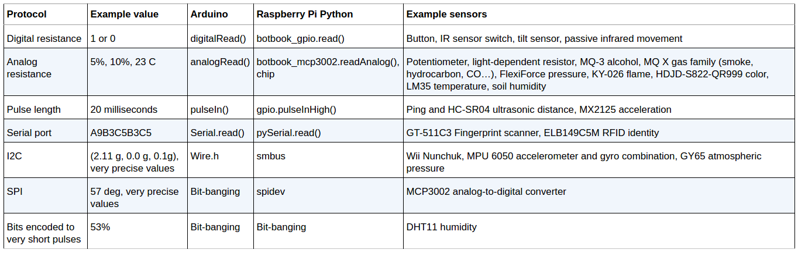

# Sensor Protocols

A protocol defines how a sensor talks to the microcontroller board, such as Arduino or Raspberry Pi. The protocol defines how the wires should be connected and how your code should ask for measurements.
Even though there is a staggering amount of different sensors, there is a limited number of popular protocols. You’ll learn each of the protocols as you work through experiments and projects, but here’s an overview of what you’ll be seeing.
You can get an overview of common sensor protocols in Table P-1.
Digital resistance
Some sensors work like a button and have two states, on or off. These sensors are easy to read. The on state is represented when a voltage referred to as HIGH is applied to the microcontroller input pin. This is usually either 3.3 volts or 5 volts depending on the microcontroller board you’re using.
Analog resistance
Analog resistance sensors change their resistance in response to a physical change (such as turning the knob of a dial). Arduino and Raspberry Pi measure the changes in resistance by measuring the voltage level that passes through the sensor. For example, you can turn a potentiometer to make its resistance larger or smaller. These analog resistance sensors are very easy to make with Arduino. Raspberry Pi needs an external chip for measuring analog values. You’ll learn to use the MCP3002 analog-to-digital converter to measure resistance with Raspberry Pi in Experiment: Follow Movement with Infrared (IR Compound Eye). Most analog input sensors report their value using resistance, so they are analog resistance sensors.
Pulse width
Some sensors report their value with a pulse width, or the period of time in which the pin is held HIGH. You use functions like pulseIn() or gpio.pulseInHigh() to read the length of the pulse. Because this is handled by a function, you don’t have to get into low-level microcontroller operations such as interrupts; it is all handled by a library.
Serial port
A serial port sends text characters between two devices. It’s the same technique your computer uses when talking to Arduino over USB. You’ll become quite familiar with the serial port when you print some messages to the Arduino serial monitor in various projects.
I2C
I2C is a popular industry standard protocol. It is commonly found inside computers and well known from Wii Nunchuk joysticks. I2C allows 128 devices to be connected to the same wires. In Make: Sensors, you’ll get ready-made code and circuits for two sensors using I2C.
SPI
SPI is another industry standard protocol. You’ll find it easy to use the code in this book for using an analog-to-digital converter on the Raspberry Pi. But creating your own code from scratch for new devices using SPI will be a bit more work.
Bit-banging
Sometimes, a sensor is unusual enough that a standard protocol won’t work with it. In those cases, you need to craft up your own code to talk to that sensor. This is often called bit-banging, because you’re manipulating the signal from the sensor, often at the bit level. You’ll see an example of that later in the book in Experiment: Is It Humid in Here?.
As you play with the sensors, you’ll get much more familiar with these protocols. Or, if you’re in a hurry to put new sensors in your robots and innovative devices, you can just use the code in this book and look at the details later.

